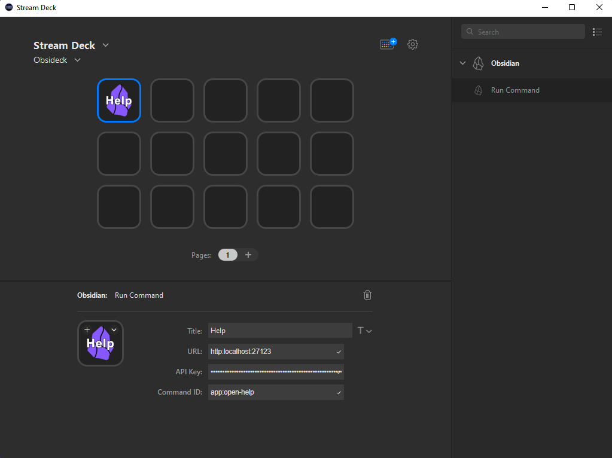
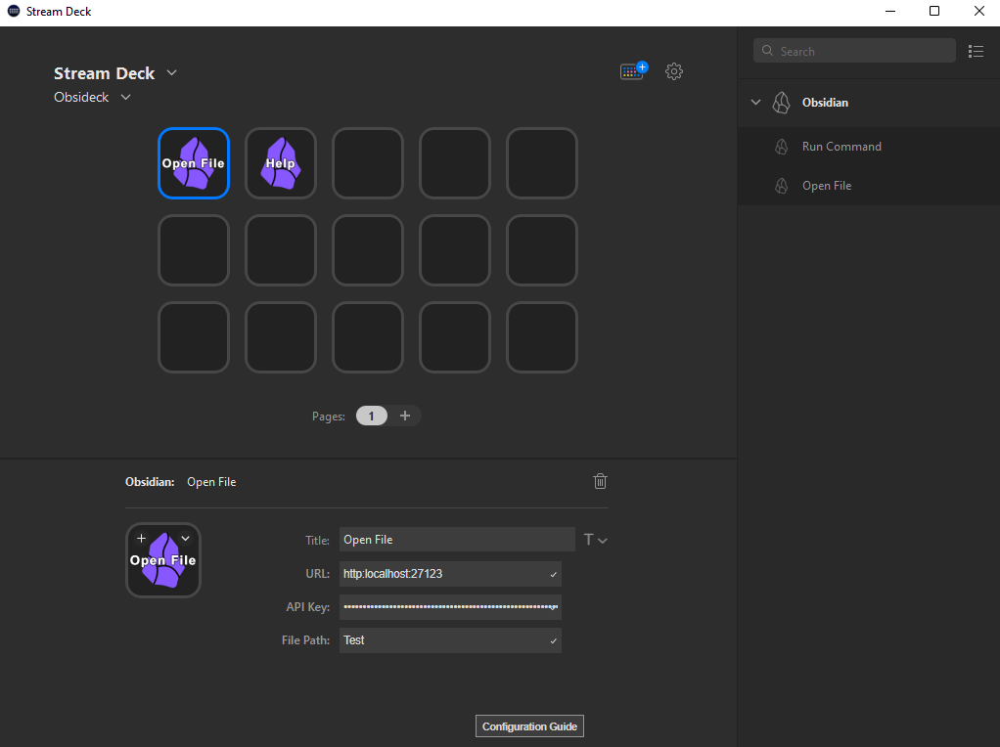

[](https://marketplace.elgato.com/product/obsideck-53fb4b45-65f6-496e-923f-8e58388e3c17)


A Stream Deck plugin that runs commands in Obsidian.

## Demo

View the plugin in action by clicking on the video below:

[](https://www.youtube.com/watch?v=O2DaEObDIYA)

## Installation

1. Install the [Local REST API plugin](https://obsidian.md/plugins?id=obsidian-local-rest-api) for Obsidian.  
2. Install this plugin from the [Elgato Marketplace](https://marketplace.elgato.com/product/obsideck-53fb4b45-65f6-496e-923f-8e58388e3c17)
or download directly from [releases](https://github.com/j4ckofalltrades/obsideck/releases).

## Configuration

In order to interact with Obsidian through the Local REST API, the plugin needs the **(1)** API Key and the **(2)** URL.

These configuration items can be found in the Local REST API plugin settings.

The plugin will use HTTPS by default and provides a self-signed certificate. Alternatively, you can enable an HTTP
server by toggling the `Enable Non-Encrypted (HTTP) server` option.

Depending on your desired configuration (using HTTPS or HTTP, custom ports), the full URL should look like:

`${scheme}://localhost:${port}`

where *scheme* is either `http` or `https` and *port* is the corresponding port
relative to the selected scheme.

## Run Command action

The `Run Command` action has the following **required** config items:

- API Key
- URL
- Command ID



The [configuration](#configuration) section details how to retrieve the `API Key` and `URL` config items.

The `Command ID` can be obtained by calling the `/commands` endpoint of the Local REST API, through the
command line or the [Local REST API playground](https://coddingtonbear.github.io/obsidian-local-rest-api).

Sample call to the commands endpoint using `curl`, if you're running MacOS:

```bash
curl -X 'GET' \
  'http://127.0.0.1:27123/commands/' \
  -H 'Accept: application/json' \
  -H 'Authorization: Bearer api_key_goes_here'

# Sample response
{
  "commands": [
    {
      "id": "app:open-help",
      "name": "Open Help"
    },
    ...
  ]
}
```

If you're running Windows, run the following command:

```powershell
curl -X "GET" ^
  "http://127.0.0.1:27123/commands/" ^
  -H "accept: application/json" ^
  -H "Authorization: Bearer api_key_goes_here"
```

### Standard commands

For ease of use, the following section lists all the available commands for a vanilla Obsidian installation.
Commands from other (community) plugins can be obtained by calling the commands endpoint.

<details>

  <summary>List of standard commands</summary>

  ```json
  {
    "commands": [
      {
        "id": "app:delete-file",
        "name": "Delete current file"
      },
      {
        "id": "app:go-back",
        "name": "Navigate back"
      },
      {
        "id": "app:go-forward",
        "name": "Navigate forward"
      },
      {
        "id": "app:open-help",
        "name": "Open help"
      },
      {
        "id": "app:open-sandbox-vault",
        "name": "Open sandbox vault"
      },
      {
        "id": "app:open-settings",
        "name": "Open settings"
      },
      {
        "id": "app:open-vault",
        "name": "Open another vault"
      },
      {
        "id": "app:reload",
        "name": "Reload app without saving"
      },
      {
        "id": "app:show-debug-info",
        "name": "Show debug info"
      },
      {
        "id": "app:show-release-notes",
        "name": "Show Release Notes"
      },
      {
        "id": "app:toggle-default-new-pane-mode",
        "name": "Toggle default mode for new tabs"
      },
      {
        "id": "app:toggle-left-sidebar",
        "name": "Toggle left sidebar"
      },
      {
        "id": "app:toggle-right-sidebar",
        "name": "Toggle right sidebar"
      },
      {
        "id": "backlink:open",
        "name": "Backlinks: Show backlinks"
      },
      {
        "id": "backlink:open-backlinks",
        "name": "Backlinks: Open backlinks for the current note"
      },
      {
        "id": "backlink:toggle-backlinks-in-document",
        "name": "Backlinks: Toggle backlinks in document"
      },
      {
        "id": "bookmarks:bookmark-all-tabs",
        "name": "Bookmarks: Bookmark all tabs..."
      },
      {
        "id": "bookmarks:bookmark-current-heading",
        "name": "Bookmarks: Bookmark heading under cursor..."
      },
      {
        "id": "bookmarks:bookmark-current-search",
        "name": "Bookmarks: Bookmark current search..."
      },
      {
        "id": "bookmarks:bookmark-current-section",
        "name": "Bookmarks: Bookmark block under cursor..."
      },
      {
        "id": "bookmarks:bookmark-current-view",
        "name": "Bookmarks: Bookmark..."
      },
      {
        "id": "bookmarks:open",
        "name": "Bookmarks: Show bookmarks"
      },
      {
        "id": "bookmarks:unbookmark-current-view",
        "name": "Bookmarks: Remove bookmark for current file"
      },
      {
        "id": "canvas:convert-to-file",
        "name": "Canvas: Convert to file..."
      },
      {
        "id": "canvas:export-as-image",
        "name": "Canvas: Export as image"
      },
      {
        "id": "canvas:jump-to-group",
        "name": "Canvas: Jump to group"
      },
      {
        "id": "canvas:new-file",
        "name": "Canvas: Create new canvas"
      },
      {
        "id": "command-palette:open",
        "name": "Command palette: Open command palette"
      },
      {
        "id": "daily-notes",
        "name": "Daily notes: Open today's daily note"
      },
      {
        "id": "daily-notes:goto-next",
        "name": "Daily notes: Open next daily note"
      },
      {
        "id": "daily-notes:goto-prev",
        "name": "Daily notes: Open previous daily note"
      },
      {
        "id": "editor:attach-file",
        "name": "Insert attachment"
      },
      {
        "id": "editor:context-menu",
        "name": "Show context menu under cursor"
      },
      {
        "id": "editor:cycle-list-checklist",
        "name": "Cycle bullet/checkbox"
      },
      {
        "id": "editor:delete-paragraph",
        "name": "Delete paragraph"
      },
      {
        "id": "editor:focus",
        "name": "Focus on last note"
      },
      {
        "id": "editor:focus-bottom",
        "name": "Focus on tab group below"
      },
      {
        "id": "editor:focus-left",
        "name": "Focus on tab group to the left"
      },
      {
        "id": "editor:focus-right",
        "name": "Focus on tab group to the right"
      },
      {
        "id": "editor:focus-top",
        "name": "Focus on tab group above"
      },
      {
        "id": "editor:fold-all",
        "name": "Fold all headings and lists"
      },
      {
        "id": "editor:fold-less",
        "name": "Fold less"
      },
      {
        "id": "editor:fold-more",
        "name": "Fold more"
      },
      {
        "id": "editor:follow-link",
        "name": "Follow link under cursor"
      },
      {
        "id": "editor:insert-callout",
        "name": "Insert callout"
      },
      {
        "id": "editor:insert-embed",
        "name": "Add embed"
      },
      {
        "id": "editor:insert-link",
        "name": "Insert Markdown link"
      },
      {
        "id": "editor:insert-tag",
        "name": "Add tag"
      },
      {
        "id": "editor:insert-wikilink",
        "name": "Add internal link"
      },
      {
        "id": "editor:open-link-in-new-leaf",
        "name": "Open link under cursor in new tab"
      },
      {
        "id": "editor:open-link-in-new-split",
        "name": "Open link under cursor to the right"
      },
      {
        "id": "editor:open-link-in-new-window",
        "name": "Open link under cursor in new window"
      },
      {
        "id": "editor:open-search",
        "name": "Search current file"
      },
      {
        "id": "editor:open-search-replace",
        "name": "Search & replace in current file"
      },
      {
        "id": "editor:rename-heading",
        "name": "Rename this heading..."
      },
      {
        "id": "editor:save-file",
        "name": "Save current file"
      },
      {
        "id": "editor:set-heading",
        "name": "Toggle heading"
      },
      {
        "id": "editor:set-heading-0",
        "name": "Remove heading"
      },
      {
        "id": "editor:set-heading-1",
        "name": "Set as heading 1"
      },
      {
        "id": "editor:set-heading-2",
        "name": "Set as heading 2"
      },
      {
        "id": "editor:set-heading-3",
        "name": "Set as heading 3"
      },
      {
        "id": "editor:set-heading-4",
        "name": "Set as heading 4"
      },
      {
        "id": "editor:set-heading-5",
        "name": "Set as heading 5"
      },
      {
        "id": "editor:set-heading-6",
        "name": "Set as heading 6"
      },
      {
        "id": "editor:swap-line-down",
        "name": "Move line down"
      },
      {
        "id": "editor:swap-line-up",
        "name": "Move line up"
      },
      {
        "id": "editor:toggle-blockquote",
        "name": "Toggle blockquote"
      },
      {
        "id": "editor:toggle-bold",
        "name": "Toggle bold"
      },
      {
        "id": "editor:toggle-bullet-list",
        "name": "Toggle bullet list"
      },
      {
        "id": "editor:toggle-checklist-status",
        "name": "Toggle checkbox status"
      },
      {
        "id": "editor:toggle-code",
        "name": "Toggle code"
      },
      {
        "id": "editor:toggle-comments",
        "name": "Toggle comment"
      },
      {
        "id": "editor:toggle-fold",
        "name": "Toggle fold on the current line"
      },
      {
        "id": "editor:toggle-highlight",
        "name": "Toggle highlight"
      },
      {
        "id": "editor:toggle-italics",
        "name": "Toggle italics"
      },
      {
        "id": "editor:toggle-numbered-list",
        "name": "Toggle numbered list"
      },
      {
        "id": "editor:toggle-source",
        "name": "Toggle Live Preview/Source mode"
      },
      {
        "id": "editor:toggle-spellcheck",
        "name": "Toggle spellcheck"
      },
      {
        "id": "editor:toggle-strikethrough",
        "name": "Toggle strikethrough"
      },
      {
        "id": "editor:unfold-all",
        "name": "Unfold all headings and lists"
      },
      {
        "id": "file-explorer:duplicate-file",
        "name": "Make a copy of the current file"
      },
      {
        "id": "file-explorer:move-file",
        "name": "Move current file to another folder"
      },
      {
        "id": "file-explorer:new-file",
        "name": "Create new note"
      },
      {
        "id": "file-explorer:new-file-in-current-tab",
        "name": "Create new note in current tab"
      },
      {
        "id": "file-explorer:new-file-in-new-pane",
        "name": "Create note to the right"
      },
      {
        "id": "file-explorer:open",
        "name": "Files: Show file explorer"
      },
      {
        "id": "file-explorer:reveal-active-file",
        "name": "Files: Reveal current file in navigation"
      },
      {
        "id": "file-recovery:open",
        "name": "File recovery: Open saved snapshots"
      },
      {
        "id": "global-search:open",
        "name": "Search: Search in all files"
      },
      {
        "id": "graph:animate",
        "name": "Graph view: Start graph timelapse animation"
      },
      {
        "id": "graph:open",
        "name": "Graph view: Open graph view"
      },
      {
        "id": "graph:open-local",
        "name": "Graph view: Open local graph"
      },
      {
        "id": "insert-current-date",
        "name": "Templates: Insert current date"
      },
      {
        "id": "insert-current-time",
        "name": "Templates: Insert current time"
      },
      {
        "id": "insert-template",
        "name": "Templates: Insert template"
      },
      {
        "id": "markdown:toggle-preview",
        "name": "Toggle reading view"
      },
      {
        "id": "note-composer:extract-heading",
        "name": "Note composer: Extract this heading..."
      },
      {
        "id": "note-composer:merge-file",
        "name": "Note composer: Merge current file with another file..."
      },
      {
        "id": "note-composer:split-file",
        "name": "Note composer: Extract current selection..."
      },
      {
        "id": "open-with-default-app:open",
        "name": "Open in default app"
      },
      {
        "id": "open-with-default-app:show",
        "name": "Show in system explorer"
      },
      {
        "id": "outgoing-links:open",
        "name": "Outgoing Links: Show outgoing links"
      },
      {
        "id": "outgoing-links:open-for-current",
        "name": "Outgoing Links: Open outgoing links for the current file"
      },
      {
        "id": "outline:open",
        "name": "Outline: Show outline"
      },
      {
        "id": "outline:open-for-current",
        "name": "Outline: Open outline of the current file"
      },
      {
        "id": "switcher:open",
        "name": "Quick switcher: Open quick switcher"
      },
      {
        "id": "tag-pane:open",
        "name": "Tags: Show tags"
      },
      {
        "id": "theme:switch",
        "name": "Change theme"
      },
      {
        "id": "theme:use-dark",
        "name": "Use dark mode"
      },
      {
        "id": "theme:use-light",
        "name": "Use light mode"
      },
      {
        "id": "window:reset-zoom",
        "name": "Reset zoom"
      },
      {
        "id": "window:toggle-always-on-top",
        "name": "Toggle window always on top"
      },
      {
        "id": "window:zoom-in",
        "name": "Zoom in"
      },
      {
        "id": "window:zoom-out",
        "name": "Zoom out"
      },
      {
        "id": "workspace:close",
        "name": "Close current tab"
      },
      {
        "id": "workspace:close-others",
        "name": "Close all other tabs"
      },
      {
        "id": "workspace:close-others-tab-group",
        "name": "Close others in tab group"
      },
      {
        "id": "workspace:close-tab-group",
        "name": "Close this tab group"
      },
      {
        "id": "workspace:close-window",
        "name": "Close window"
      },
      {
        "id": "workspace:copy-path",
        "name": "Copy file path"
      },
      {
        "id": "workspace:copy-url",
        "name": "Copy Obsidian URL"
      },
      {
        "id": "workspace:edit-file-title",
        "name": "Rename file"
      },
      {
        "id": "workspace:export-pdf",
        "name": "Export to PDF..."
      },
      {
        "id": "workspace:goto-last-tab",
        "name": "Go to last tab"
      },
      {
        "id": "workspace:goto-tab-1",
        "name": "Go to tab #1"
      },
      {
        "id": "workspace:goto-tab-2",
        "name": "Go to tab #2"
      },
      {
        "id": "workspace:goto-tab-3",
        "name": "Go to tab #3"
      },
      {
        "id": "workspace:goto-tab-4",
        "name": "Go to tab #4"
      },
      {
        "id": "workspace:goto-tab-5",
        "name": "Go to tab #5"
      },
      {
        "id": "workspace:goto-tab-6",
        "name": "Go to tab #6"
      },
      {
        "id": "workspace:goto-tab-7",
        "name": "Go to tab #7"
      },
      {
        "id": "workspace:goto-tab-8",
        "name": "Go to tab #8"
      },
      {
        "id": "workspace:move-to-new-window",
        "name": "Move current tab to new window"
      },
      {
        "id": "workspace:new-tab",
        "name": "New tab"
      },
      {
        "id": "workspace:next-tab",
        "name": "Go to next tab"
      },
      {
        "id": "workspace:open-in-new-window",
        "name": "Open current tab in new window"
      },
      {
        "id": "workspace:previous-tab",
        "name": "Go to previous tab"
      },
      {
        "id": "workspace:split-horizontal",
        "name": "Split down"
      },
      {
        "id": "workspace:split-vertical",
        "name": "Split right"
      },
      {
        "id": "workspace:toggle-pin",
        "name": "Toggle pin"
      },
      {
        "id": "workspace:toggle-stacked-tabs",
        "name": "Toggle stacked tabs"
      },
      {
        "id": "workspace:undo-close-pane",
        "name": "Undo close tab"
      }
    ]
  }
  ```
</details>

## Open File action

The `Open File` action has the following **required** config items:

- API Key
- URL
- File Path



The [configuration](#configuration) section details how to retrieve the `API Key` and `URL` config items.

A couple of things to note regarding `File Path`, the first is that it is relative to the current vault root and the
other is that the forward slash character (/) must be used as the file separator.

Consider the following example where **notes** is the name of the current vault.

```bash
notes/
├── 1.md
└── dir
    └── 2.md
```

The file path for the first file will be `1.md` while the path for the other file will be `dir/2.md`.
