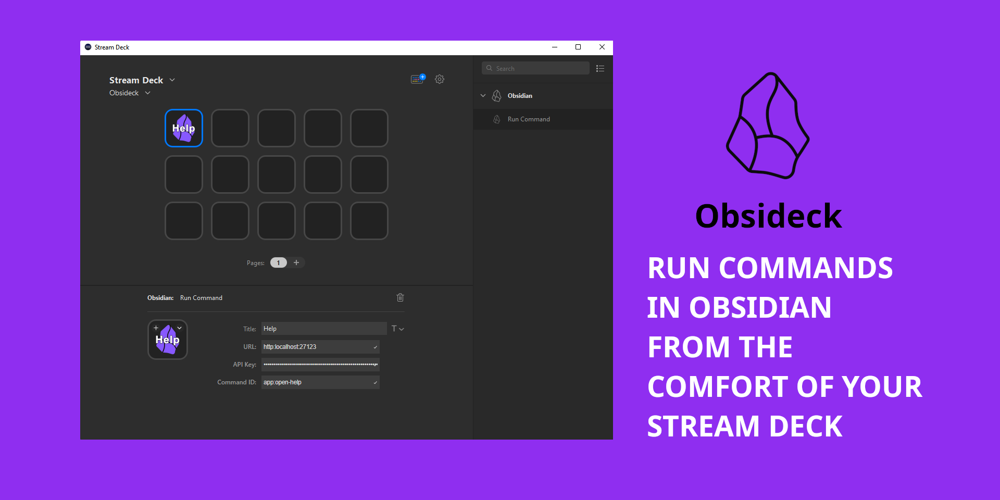

<div align="center">
  <br/>
  <a href="https://github.com/j4ckofalltrades/obsideck">
    
  </a>
</div>

<br/>

# Obsideck

A Stream Deck plugin that runs commands in Obsidian (via the Local REST API plugin).

## Installation

1. Install the [Local REST API plugin](https://github.com/coddingtonbear/obsidian-local-rest-api) for Obsidian.  
2. Install this plugin from the [Stream Deck store](https://apps.elgato.com/plugins/dev.jduabe.obsideck) or from [releases](https://github.com/j4ckofalltrades/obsideck/releases).

## Configuration



The `Run Command` action has the following __required__ properties:

- URL 
- API Key
- Command ID

The `URL` and `API Key` properties can be found in the plugins' settings in Obsidian.

The list of available commands can be obtained by calling the `/commands` endpoint or through the plugin's [docs](https://coddingtonbear.github.io/obsidian-local-rest-api).

Note: The API plugin uses HTTPS by default.

```bash
curl -X 'GET' \
  'http://127.0.0.1:27123/commands/' \
  -H 'Accept: application/json' \
  -H 'Authorization: Bearer api_key'

# Sample response
{
  "commands": [
    {
      "id": "app:open-help",
      "name": "Open Help"
    }
  ]
}
```

